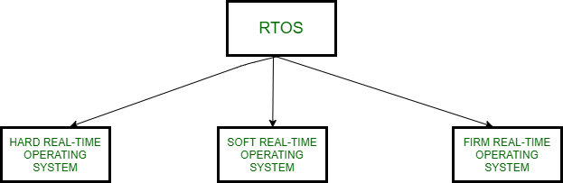

# Realtime Operating Systems

Real-time operating systems (RTOS) are used in environments where a large number of events, mostly external to the computer system, must be accepted and processed in a short time or within certain deadlines. such applications are industrial control, telephone switching equipment, flight control, and real-time simulations. With an RTOS, the processing time is measured in tenths of seconds. This system is time-bound and has a fixed deadline. The processing in this type of system must occur within the specified constraints. Otherwise, This will lead to system failure.

# Types of RTOS

## Hard Real-Time Operating System

These operating systems guarantee that critical tasks be completed within a range of time.
For example, a robot is hired to weld a car body. If the robot welds too early or too late, the car cannot be sold, so it is a hard real-time system that requires complete car welding by robot hardly on the time.

## Soft Real-Time Operating System

This operating system provides some relaxation in the time limit.
For example – Multimedia systems, digital audio systems etc. Explicit, programmer-defined and controlled processes are encountered in real-time systems. A separate process is changed with handling a single external event. The process is activated upon occurrence of the related event signalled by an interrupt.

## Firm Real-Time Operating System

RTOS of this type have to follow deadlines as well. In spite of its small impact, missing a deadline can have unintended consequences, including a reduction in the quality of the product. Example: Multimedia applications.

# Advantages and Disadvantages of RTOS

<table>
  <thead>
    <tr>
      <th>Advantage</th>
      <th>Disadvantage</th>
    </tr>
  </thead>
  <tbody>
    <tr>
      <td>
        Maximum consumption of resources
      </td>
      <td>
        Limited tasks can be executed at the same time
      </td>
    </tr>
    <tr>
      <td>Task shifting is less</td>
      <td>heavy system resources</td>
    </tr>
    <tr>
      <td>Focuses on running applications</td>
      <td>Complex algorithms</td>
    </tr>
    <tr>
      <td>Can be used in embedded systems</td>
      <td>Specific drivers are needed to respond to system interrupts</td>
    </tr>
    <tr>
      <td>Error free systems</td>
      <td>Thread priority is poor</td>
    </tr>
    <tr>
      <td>Memory allocation is best managed</td>
      <td>Minimum task switching</td>
    </tr>
    
  </tbody>
</table>
