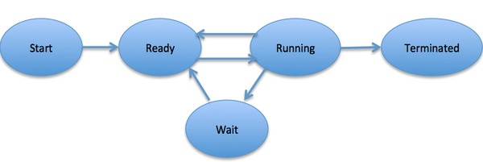

# Process State

Process state is the current state of the process. It can be either ready, running, waiting, terminated, etc.

# Process lifecycle

When a process executes, it passes through different states. These stages may differ in different operating systems, and the names of these states are also not standardized.

In general, a process can have one of the following five states at a time.

- Start - The process is created and ready to be executed.
- Ready - The process is waiting to be assigned to a processor. Ready processes are waiting to have the processor allocated to them by the operating system so that they can run.
- Running - Once the process has been assigned to a processor by the OS scheduler, the process state is set to running and the processor executes its instructions.
- Waiting - Process moves into the waiting state if it needs to wait for a resource, such as waiting for user input, or waiting for a file to become available.
- Terminated - Once the process finishes its execution, or it is terminated by the operating system, it is moved to the terminated state where it waits to be removed from main memory.
